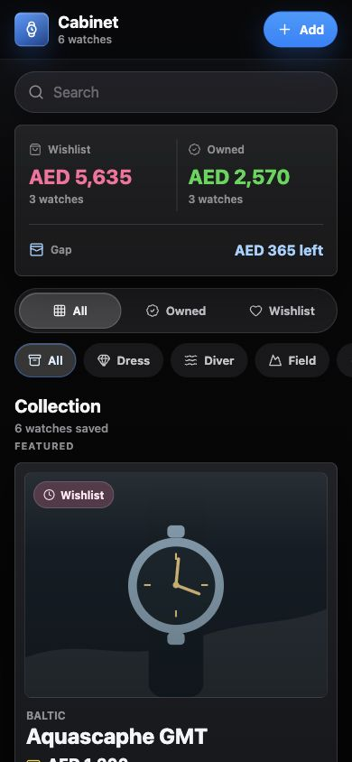
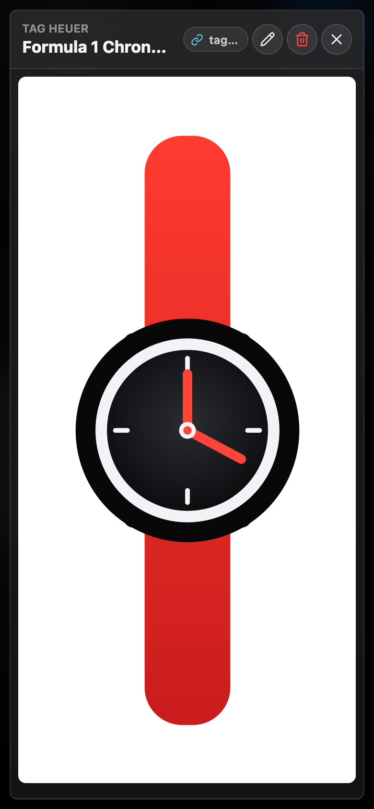
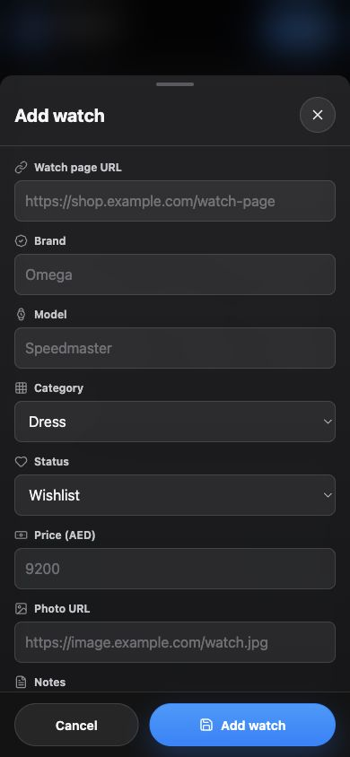
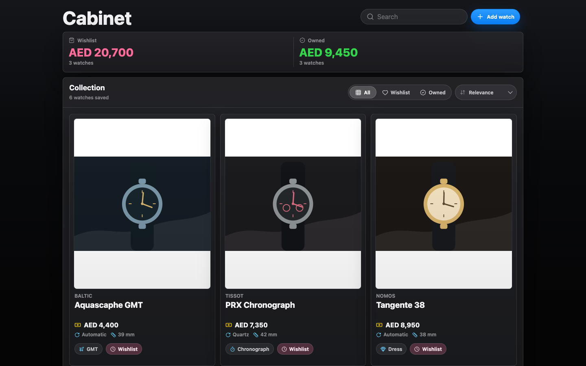

<div align="center">

# Watchlist Cabinet

A private, mobile-first watch collecting app for tracking owned watches, wishlist watches, and AED collection totals.


</div>

## Screenshots

<table>
  <tr>
    <td align="center">
      <strong>Mobile collection</strong><br />
      
    </td>
    <td align="center">
      <strong>Image preview</strong><br />
      
    </td>
    <td align="center">
      <strong>Add watch</strong><br />
      
    </td>
  </tr>
  <tr>
    <td align="center" colspan="3">
      <strong>Desktop collection</strong><br />
      
    </td>
  </tr>
</table>

## Features

- Add watches from any shop page with brand, model, reference number, category, status, price, movement, and case size.
- Save up to five images per watch, either from image URLs or Supabase Storage uploads.
- Track owned and wishlist watches in one dark, image-first collection grid.
- Filter by All, Wishlist, and Owned.
- Sort by relevance, price high to low, or price low to high.
- See owned value and wishlist total in AED.
- Swipe through image sets on the grid, then open a large gallery with edit, delete, and external shop link actions.
- Share a public wishlist link that does not require visitors to log in.
- Use local browser storage without Supabase, or sync privately with Google login and Supabase.

## Stack

- React + TypeScript + Vite
- Supabase Auth and Postgres
- Vercel
- Lucide icons
- Custom dark CSS design system

## Local Development

```bash
npm install
npm run dev
```

Open `http://127.0.0.1:4173/`.

Without Supabase env vars, the app uses sample data and stores changes in `localStorage`.

## Supabase

Run the database and storage schema in Supabase SQL Editor:

```text
supabase/schema.sql
```

Create `.env.local`:

```bash
cp .env.example .env.local
```

Set:

```bash
VITE_SUPABASE_URL=
VITE_SUPABASE_PUBLISHABLE_KEY=
VITE_SITE_URL=
```

The schema also creates a public `watch-images` Storage bucket so uploaded watch images can render inside shared wishlist links.

Then enable Google as the only Supabase Auth provider and allow-list the deployed app URL plus local dev URL in Supabase Auth URL settings.

## Deploy

Deploy the private GitHub repo to Vercel and add the same env vars in the Vercel project settings. The included `vercel.json` rewrites direct routes such as `/share/:token` back to the app.

## Scripts

```bash
npm run dev        # Start local development
npm run build      # Typecheck and build for production
npm run preview    # Preview the production build
npm run typecheck  # Run TypeScript checks
```
